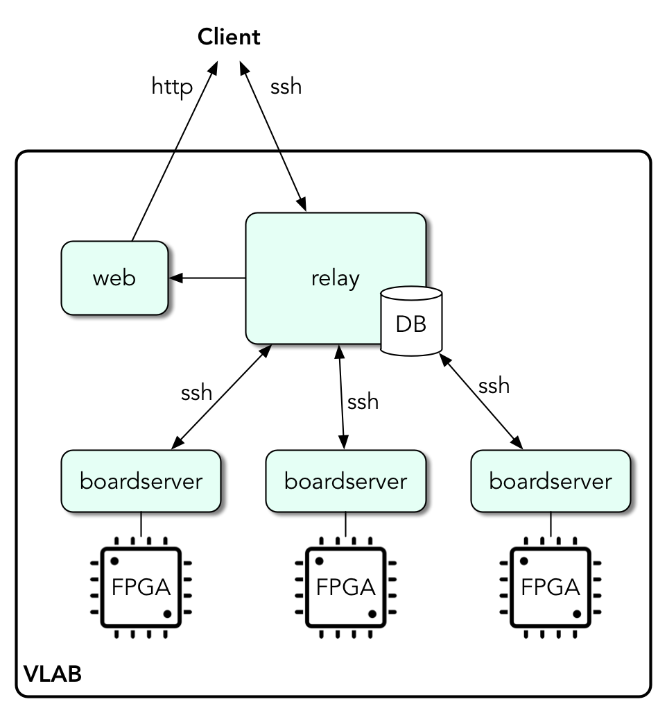

# The VLAB

## Purpose of the VLAB

The Virtual Lab (VLAB) is designed to allow a team of people to share remote access to individual [FPGA](https://en.wikipedia.org/wiki/Field-programmable_gate_array) development boards. The VLAB provides user access control, mutual exclusion, load balancing, statistics, and logging. 

The VLAB was developed to support two main use cases:
* To allow a development team to share access to a small number of expensive development boards. Also this has the benefit that these boards can be safely in a server room instead of on someone's desk.
* To support an external access teaching framework, allowing boards to be served at a centralised location but accessed securely by many external users.


## Overall organisation

The VLAB is structured as follows:



The main entry point for clients is the _relay_ server. The client software connects to the relay (using `ssh`) and requests access to an FPGA board of a given type. The relay authenticates the user, and if they are allowed to access the board type that they have requested, a free FPGA board of the requested type is selected and the user is forwarded on to the _boardserver_ responsible for serving it. 

The VLAB makes use of [Docker](https://www.docker.com) and consists of three Docker images:

* Relay - the main entrypoint to the VLAB.
* Boardserver - a boardserver container is created for each hosted FPGA, and is responsible for actually serving the FPGA.
* Web - provides statistics tracking in a handy web interface.

These containers can be hosted on any physical server, and may be all the same server in small deployments.

`relay` and `web` are always running. `boardserver` instances are started by [udev](https://en.wikipedia.org/wiki/Udev) rules which detect when a supported FPGA device is connected, read its serial number, and use this to launch an instance of the `boardserver` container to serve the FPGA. For the purpose of this documentation, a physical server which is configured to look for FPGAs and launch instances of the `boardserver` container are called _board hosts_.


## Client Installation and Use

The client script can be downloaded directly from [Github](https://github.com/RTSYork/VLAB). It has no external dependencies, apart from [Python 3](https://www.python.org/downloads/) itself. 

To use the client you must have a keyfile which should have been sent to the client by the VLAB administrator. Connect to the VLAB using:

```
./vlab.py -k keyfile -b requested_board_class
```

If the VLAB relay server or port are not the defaults defined in the script they can be specified with the `-r` and `-p` options respectively. Also if you must use a different username to the currently logged in user you can use `-u`.

```
./vlab.py -r a_servername -p 2223 -u vlabuser -k keyfile -b requested_board_class
```

These commands will request a free board of the board class `requested_board_class` and, if one is free, connect to it. Local port `12345` will be connected to the remote hardware server for that board, so the Xilinx tools can be pointed at `localhost:12345` to program and debug the FPGA, whilst the terminal will show the serial UART input and output.

The terminal uses [GNU Screen](https://www.gnu.org/software/screen/) so to disconnect press `Ctrl-A`, release all keys, then press `k` (kill).


## Installation

### Relay Server Installation

The relay server is tested on Ubuntu Linux, but should work on similar operating systems. Docker makes installation simple. Ensure that [Docker is installed](https://docs.docker.com/engine/installation/) and clone the VLAB repository:

```
git clone https://github.com/RTSYork/VLAB
```

First, you need to edit `vlab.conf`. This file describes the FPGA boards in your lab and the users who can access them. This is described in more detail [here](#configuration).

You then need to set up ssh keypairs for use inside the VLAB. To do this run:

```
./manage.py generatekeys --internal
```

This will construct a keypair which is used by the relay server to communicate with the boardservers. This will be stored in `/keys/` and should be protected appropriately. When you edited `vlab.conf` you should have added some users to the system. These users also need keypairs which can be generated by running:

```
./manage.py generatekeys --allnew
```

This command creates a keypair for all users that are mentioned in `vlab.conf` and does not already have a key pair in the `/keys/` directory. These are stored as `/keys/$username` and `/keys/$username.pub` for the private and public keys respectively. The user needs the private key in order to use the VLAB. Should you need to recreate these, you can simply delete the pair and rerun `generatekeys --allnew`. 

Once configuration and keys are set up, build the VLAB containers with:

```
./manage.py build
```

This instructs Docker to build the images for the relay server, web server, and board servers. Finally to start the service use:

```
./manage.py start
```

The images will need to be rebuilt if changes are make to the internal keypair, but changes to the configuration or user keypairs only require the containers to be restarted. You likely want to configure the VLAB containers to start automatically on boot. There are many way to do this [covered in the Docker documentation](https://docs.docker.com/engine/admin/host_integration/). For example, on a `systemd`-based system, create the file `/etc/systemd/system/vlab.service`:

```
[Unit]
Description=VLAB
Requires=docker.service
After=docker.service

[Service]
Restart=always
ExecStart=/usr/local/bin/docker-compose -f /opt/VLAB/docker-compose.yml up --force-recreate
ExecStop=/usr/local/bin/docker-compose -f /opt/VLAB/docker-compose.yml stop

[Install]
WantedBy=default.target
```
The service can be started and stopped with `systemctl start vlab.service` and `systemctl stop vlab.service`, or made to restart every boot with `systemctl enable vlab.service`.

Clients will `ssh` to the `relay` container hosted here, so its port (2222 by default) should be externally-visible. If you need to use another port then you can edit the port mapping for the relay service in `docker-compose.yml`. Change the line:

```
	- "2222:22"
```

This line says that port 22 in the container should be mapped to port 2222 on the host machine. If another port is required it can be changed. Remember that users will have to use the `-p` option to specify the non-default port:

```
./client.py -r relayserver.local -p 2223 -k ./mykey.key -b zynq 
```


### Board Host Installation

As described previously, board hosts are the servers to which the actual FPGA boards are connected. There can be multiple board hosts, and can be the same machine that the relay server is running. udev rules recognise when FPGAs are attached and instances of the `boardserver` container are launched to serve it. 

To set up a board host, first send the boardserver Docker image from where you built it to the new board host:

```
docker save -o boardserver.tar vlab/boardserver
scp boardserver.tar newboardhost:~/
```

Then clone the `host` directory to the new board host, load the image, and run the `install.sh` script.

```
docker load -i ~/boardserver.tar
cd host
sudo ./install.sh
```

Finally, if you wish to use Digilent's boards on your board host you need to install the Digilent tools. Go to the [Digilent website](https://reference.digilentinc.com/reference/software/adept/start) and download the Runtime and Utilities. This example describes using the `.zip` versions. As root:

```
unzip digilent.adept.runtime_*.zip
unzip digilent.adept.utilities_*.zip
mkdir -p /etc/hotplug/usb/
cd digilent.adept.runtime_*/
./install.sh silent=1
cd ../digilent.adept.utilities_*/
yes "" | ./install.sh 
```

This should add a utility called `dadutil` to your `$PATH` which can be used to enumerate Digilent boards connected to the board host.


#### Supporting FPGA Boards on the Board Hosts

When a new FPGA board is connected to a board host the following takes place:

1. udev recognises a device connection event and starts executing its rules (in `/etc/udev/rules.d/`)
2. The appropriate rule executes `/opt/VLAB/boardconnected.py` and passes it the serial number.
3. `boardconnected.py` sends the serial number to the `relay` server, which looks it up to see if it is a device detailed in `vlab.conf`.
4. If not, the unknown device is rejected and logged.
5. If it is, the `relay` server informs `boardconnected.py` which type of device it is, and so which container should be launched to host it. Currently only one type of container is required, but more diverse boards may require other containers in the future.

Consequentially, each supported FPGA must have a unique serial number, and that serial number must be readable by udev. It is often in fact the case that all FPGA development boards of the same type come from the factory with the same serial number a utility program is required to set a serial number first.

@@@@@@@@@@

To add information about how to do this.

@@@@@@@@@@


## Configuration

The VLAB is configured by `vlab.conf`, which describes two things:

1. The FPGAs in the system
    * FPGAs are identified by their serial number. [udev](https://en.wikipedia.org/wiki/Udev) rules on the host machine detect when a device is connected, read its serial number, and use this to launch an instance of the `boardserver` container to serve the FPGA.
    * If an unknown FPGA serial number is detected then no `boardserver` will be created. The logfile `log/attachdetach.log` will contain a line detailing the unknown serial number.
    * Each FPGA also has an assigned _board class_. Users request board classes, rather than specific boards. This allows for FPGAs to be grouped together and users load balanced across them.
2. The users in the system
    * Users have an `overlord` flag, which if set means that they can access all boards on the VLAB.
    * Otherwise, users are given a list of the board classes which they are allowed to access. Users may only connect to board classes they are allowed to.

`vlab.conf` is [volume mapped](https://docs.docker.com/engine/tutorials/dockervolumes/) into the `relay` container. After editing `vlab.conf` the `relay` container must be restarted with:

```
./manage.py start
```

`vlab.conf` is in JSON format. An example is shown below:

```
{
	"users": {
		"example_user": {"allowedboards": ["boardclass_a", "boardclass_b"]},
		"overlord_user": {"overlord": true}
	},

	"boards": {
		"exampleboardserialnumber": {"class": "boardclass_a", "type": "standard"}
	}
}
```

In this example there is one board with a serial number `exampleboardserialnumber` assigned to the boardclass `boardclass_a`. `"type"` in the board definition is a string used to tell the VLAB which drivers are required to interact with the board. Currently `"type"` is not used because all supported boards can be served from the same container.


